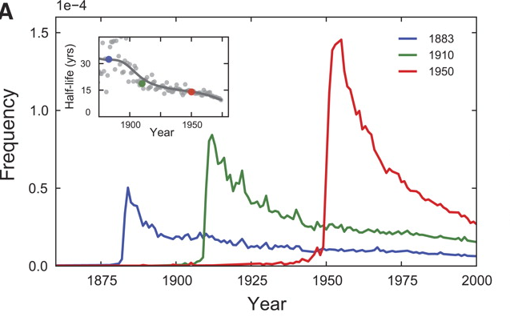
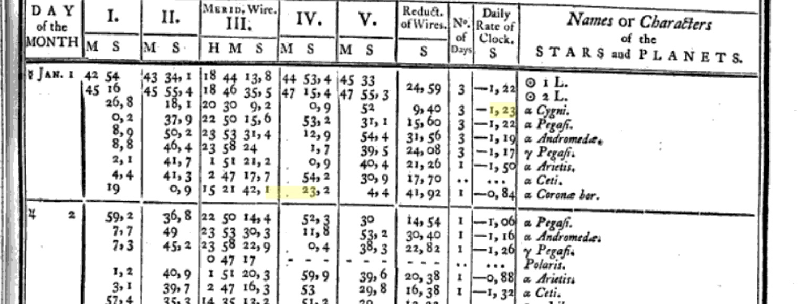
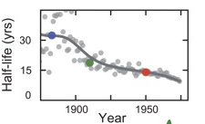

```{r,echo=FALSE}
library(knitr)
```

This notebook tackles (part of) Exercise 2.6 in Matthew Salganik's *Bit by Bit*. The core of the exercise is to use [Google Books n-grams data](http://storage.googleapis.com/books/ngrams/books/datasetsv2.html) to replicate Figure 3A in Michel, et al.'s 2011 *Science* article ["Quantitative analysis of culture using millions of digitized books."](https://doi.org/10.1126/science.1199644):

```{r, echo=FALSE, out.width="50%", fig.pos="h"}

```

This tracks mentions of "1883", "1910", and "1950" in the Google Books English corpus over time, which all show a peak in the year in question followed by decay, and, in the inset, the rate of decay, or "forgetting," as measured by half-life. Michel et al. describe the point of this as "Cultural turnover is accelerating." The main graph, they argue, shows "[w]e forget," and the inset shows "[w]e forget faster" in recent years.

There are a variety of ways to tackle this problem. In my preferred solution, I wrote a bash shell script that (a) downloads the necessary files, (b) uncompresses the big compressed file, (c) extracts what it needs from that file, (d) cleans up the weird total counts file, and (e) runs an R script to load the data, do some calculations, and draw the plots. 

Those scripts are in the github directory and there is a video in which I show how to run these on the Penn State ACI-i cluster here: https://www.youtube.com/watch?v=klR5eRslFQw

In this notebook, I show you these and other bash alternatives, as well as how you might tackle this entirely within R.

## Identifying the necessary files

We don't need all of the Google Books data. You're tracking the usage of terms like `1870` and `1950`, so you just need the file that contains those. Which file is that?

First, those are *strings* that also happen to be all numerical digits. You later have to do math with those, so in that context they need to be numbers. Keeping track of which is which is important.

Second, those are *unigrams* or *1-grams* just like `frog`, `ball`, `tree` ... single *tokens* or chunks of text that mostly correspond in English to single words. *2-grams* or *bigrams* would be two tokens in sequence like `of the` or `social security`. For bigger numbers we often just use the number, e.g., `make America great again` is a *4-gram*. The term *ngram* refers to the general concept. These are not necessarily words depending on what *tokenization* rules are used to process the text. Here, for example the single word `Burt's` is a bigram, `Burt 's`. Moreover, these are from OCR, so there are plenty of nonsense tokens in the data. The first token in the file you are downloading is `1'23`, which first appeared in 1799. The book it appeared in is *Astronomical Observations, Made at the Royal Observatory at Greenwich* which is a bunch of tables. Page 257 has two instances of this token, each a different mistake:

```{r}

```

In any case, we need the file for "1-grams" that start with the character `1` (in the 2012 English corpus), which is big, as well as the `total_counts` file, which is tiny but weird, off the ngrams datasets page: http://storage.googleapis.com/books/ngrams/books/datasetsv2.html

## Downloading the data files

You can just click and download of course, but it would be better practice to do so via a replicable piece of code.

You can do this a variety of ways. You can do it in the unix shell commands like `wget` or `curl` (remove the # comment to run).

```{bash}
# wget http://storage.googleapis.com/books/ngrams/books/googlebooks-eng-all-1gram-20120701-1.gz

# wget http://storage.googleapis.com/books/ngrams/books/googlebooks-eng-all-totalcounts-20120701.txt

# Some systems don't have wget. They usually have curl, which needs an output file specified with the -o flag.

# curl -o googlebooks-eng-all-1gram-20120701-1.gz http://storage.googleapis.com/books/ngrams/books/googlebooks-eng-all-1gram-20120701-1.gz

# curl -o googlebooks-eng-all-totalcounts-20120701.txt http://storage.googleapis.com/books/ngrams/books/googlebooks-eng-all-totalcounts-20120701.txt
```

You can do this directly in R with `download.file`, which under the hood itself calls wget, curl, or similar utility on your system (remove the # comment to run):

```{r}
# download.file("http://storage.googleapis.com/books/ngrams/books/googlebooks-eng-all-1gram-20120701-1.gz", destfile="googlebooks-eng-all-1gram-20120701-1.gz")

# download.file("http://storage.googleapis.com/books/ngrams/books/googlebooks-eng-all-totalcounts-20120701.txt", destfile="googlebooks-eng-all-totalcounts-20120701.txt")
```

## Decompressing that `.gz` file

Again, on most systems you can double-click and the file will decompress.

In the shell, you just use `gunzip` (remove the # comment to run):

```{bash}
# gunzip googlebooks-eng-all-1gram-20120701-1.gz
```

You can access that directly from R with the `R.utils` package (remove the # comment to run):

```{r}
# library(R.utils)
# gunzip("googlebooks-eng-all-totalcounts-20120701.txt.gz", remove=FALSE)
```

(Base R's `untar` function is supposed to be able to do this, but it threw errors for me.)

In the shell, you can look at a sample of the file without uncompressing it on disk. The `-c` flag tells `gunzip` to write not to a file but to "standard output" (which, doing nothing else, means print on screen). We can do this and "pipe" that output with `|` to the `head` command which shows us the top 10 lines of the uncompressed file.

```{bash}
gunzip -c googlebooks-eng-all-1gram-20120701-1.gz | head
```

There's that weird `1'23` unigram we talked about above.

(Not sure why that also throws an error when executed from an R notebook like this. It still did what I asked it to.)

## Filtering data to ngrams of interest (years)

### In the bash shell

I personally try to deal with big files like this in the shell, so I'm not having to load the whole file into working memory.

The exact syntax differs by the flavor of Unix you have installed. Both versions below use a version of `grep` to search for a particular pattern in a file, outputting each line with a match. The `> micheldata.txt` tells it to write the contents to a new file called "micheldata.txt" rather than its default behavior of printing it to the screen.

The pattern is defined by a *regular expression*. In this case, our regular expression is the string: `"^18[789]\d\s|^19\d\d\s"`. What's that mean?

The `|` in the middle means "or", so this asks to find matches of `^18[789]\d\s` or `^19\d\d\s`.

The `^` means beginning of the line, so this asks to find lines that begin with `18[789]\d\s` or `19\d\d\s`.

That second one is a little easier. `\d` means "any digit" and `\s` means "any whitespace character". So `19\d\d\s` means any four digit number that begins with `19` followed by a space. In other words, find the unigrams that match years `1900` through `1999`.

That first one is similar, except instead of starting with `19` we start with `18` and instead of the first `\d` we have `[789]`. The square brackets are also an "or" for single characters. So `[789]` means `7` or `8` or `9`. So, find all four digit numbers starting with `187`, `188`, or `189` and followed by a space. In other words, find the unigrams that match years `1870` through `1899`.

All together, this says find the lines that start with the unigrams for the years 1870 through 1999 and write them to the new file `micheldata.txt`.

```{bash}
#On ACI, this command works
#LANG=C grep -P "^18[789]\d\s|^19\d\d\s" google*-1 > micheldata.txt

#On Mac OSX, this command works
#egrep "^18[789]\d\s|^19\d\d\s" google*-1 > micheldata.txt

#I'll add "time" to the front, so we get a sense of how long this takes
time egrep "^18[789]\d\s|^19\d\d\s" google*-1 > micheldata.txt


head micheldata.txt
```

For convenience, let's get that in a sorted order. The `-o` flag just tells sort to output to a file. In this case we just replace the contents of `micheldata.txt`.

```{bash}
sort micheldata.txt -o micheldata.txt
head micheldata.txt
```

### In R
If you're not going to filter the big ngrams file in the shell, you need a way to deal with it in R.

You need to be careful reading in files this big. This seems not quite big enough to crash a modern computer, so we probably can load it all at once despite what I said in class before. But it will be very slow if not done efficiently.

The state of the art keeps shifting, but the leaders on this front now appear to be tidyverse package `vroom` and data.table's `fread`. But data.table requires some somewhat different syntax and, in my tests with this, vroom missed about 15 million lines of the file.

The time is completely tolerable to use the most straightforward command here, `read_tsv` from the tidyverse package `readr`.

```{r}
library(readr)
```

If using the R notebook directly, remove `echo=FALSE` in the chunk header. The `read_tsv` provides a very handy progress update that you'll want to see. But in the html notebook this displays thousands of lines of text.
```{r, echo=FALSE}
ngrams1.tbl <- read_tsv("googlebooks-eng-all-1gram-20120701-1",col_names=c("ngram","year","term_count","volume_count"), col_types="ciii")
```
1.4GB!

```{r}
dim(ngrams1.tbl)
```
Almost 77 million lines!

```{r}
head(ngrams1.tbl)
```

Now we need to get rid of most of that, filtering down to just the rows we want. We found the matching lines in the shell code  before with the regular expression `"^18[789]\d\s|^19\d\d\s"`. 

We need to modify that in two ways. First, the R regular expressions engine requires double escapes (see the Regular Expressions notebook), so that makes it `"^18[789]\\d\\s|^19\\d\\d\\s"`.

Second, we are matching the column of just unigrams, not lines. That is, we want to find "1870" not "1870  1901  1 1". So we want the string to *end* after four digits, not be followed by whitespace. So that makes it `"^18[789]\\d$|^19\\d\\d$"`.

OK, so now we'll use `filter` from the dplyr library and `str_detect` to tell it which rows meet the condition of matching our regular expression.

```{r}
library(dplyr)
library(stringr)
```

```{r}
micheldata <- filter(ngrams1.tbl,str_detect(ngram,"^18[789]\\d$|^19\\d\\d$"))
```

```{r}
dim(micheldata)
```
Under 35000 lines!

```{r}
head(micheldata)
```

And we don't need to, but again we'll sort that to make it more intuitive.

```{r}
micheldata <- arrange(micheldata,ngram,year)
head(micheldata)
```

We don't need the huge ngrams table any more so let's get rid of it and "garbage collect" the memory.

```{r}
rm(ngrams1.tbl)
gc()
```

## Cleaning up the total counts file

The total counts file is weird. It has fields delimited by commas, and records (lines) delimited by tabs. Plus it starts and ends with some stray tabs that will produce blank records if we're not careful.

### In the bash shell

This is pretty easy to deal with in bash.

The magic command is `tr` ("translate" or "transliterate") which can, for example, make highly efficient string substitutions in files. Here we pass the totalcounts file to `tr` and ask it to replace every tab character (`\t`) with a newline character (`\n`), and then write that new result to `totalcounts.txt`.

That leaves it with a blank line at the start, so we get rid of it with the `tail` command. Just like `head` gives us lines from the top of a file, `tail` gives them from the bottom. Here, we ask it to give us the last lines of the file from  the second line.

```{bash}
tr '\t' '\n' < googlebooks-eng-all-totalcounts-20120701.txt > totcounts.txt

tail -n +2 totcounts.txt > totcounts.csv
```

We now have a completely standard csv file in totcounts.csv, which we can read in to R.

### In R

It's slightly harder in R. First, we'll read it in. It's just one line, so

```{r}
totcountsstring <- read_lines("googlebooks-eng-all-totalcounts-20120701.txt")
```

If you printed it, you learned the hard way, it's over 10000 characters long:
```{r}
nchar(totcountsstring)
```

And it doesn't make much sense. Let's look at the first 50 characters:
```{r}
str_sub(totcountsstring,1,50)
```

Why aren't those tabs newlines? No idea.

```{r}
totcountslines <- str_split(totcountsstring,"\t")
```

`str_split` returns a list -- one object for every string in the vector passed to it -- with each of those objects a vector of the substrings after the split. We passed it *one* string, so it's a list that is one object long:
```{r}
length(totcountslines)
```

However, that one list element consists of a vector of 427 substrings, each representing one year of data:

```{r}
length(totcountslines[[1]])
```

Or at least, each one should represent one year of data. But we have a blank at the front and back end of this for some reason:

```{r}
head(totcountslines[[1]],3)
tail(totcountslines[[1]],3)
```

Now, we'll get that vector, remove its blank first and last element/line, and either print it to a csv file to match the output from the bash solution, or pass it (a vector of 425 strings) to `str_split` to be split on the commas.

First a vector without the first and last:
```{r}
totcountslines.vec <- totcountslines[[1]][-1]
totcountslines.vec <- totcountslines.vec[-length(totcountslines.vec)]
```

We could write this directly to a csv file:
```{r}
write_lines(totcountslines.vec, path="totcountsR.csv")
```

Check that it looks right:
```{r}
system("head totcountsR.csv")
```


Or, we can go directly to making it a data.frame. Split on the commas, and we'll use the `simplify=TRUE` option to get the output as a matrix rather than a list.

```{r}
totcounts.mat <- str_split(totcountslines.vec,",",simplify=TRUE)
dim(totcounts.mat)
head(totcounts.mat)
```

Those are all character data, so to make them the numbers we need and put them in a tibble, we'd do something like

```{r}
totcounts.df <- data.frame(year=as.integer(totcounts.mat[,1]),match_count=as.numeric(totcounts.mat[,2]),page_count=as.numeric(totcounts.mat[,3]),vol_count=as.numeric(totcounts.mat[,4]))
```

Another potential trap here. The numbers in this file are years and three counts, all of which are conceptually integers. But the second column, the "match_count" reaches 19482936409 ... over 19 billion. R's maximum integer is about 2.1 billion. The third column, "page_count" is creeping up there, at 109 million. So, don't try to store those as integers, otherwise some will be converted to missing (NA).


## Read in and merge the data

If you created the intermediate files with bash, or are using mine, you need to read them in. If you created the intermediate objects in R, you need to change the variable names to match this step:

```{r}
micheldata <- read_tsv("micheldata.txt", col_names=c("ngram","year","term_count","volume_count"), col_types="ciii")
head(micheldata)

totcounts <- read_csv("totcounts.csv", col_names=c("year","match_count","page_count", "vol_count"))
head(totcounts)
```

## Merge the data

For each ngram, we want the *fraction* of the total counts (`match_count`) for each year that is represented by the ngram counts (`term_count`) for that year. 

We have two dataframes/tibbles. `totcounts` has 425 rows with `year` and `match_count`, which will be our denominator. Some of those years -- like 1515 -- we don't care about. `micheldata` has 34866 rows with `ngram` (which is, confusingly, always a year), `year`, and `term_count`, which will be the numerator. We care about all of those.

So we want to *merge* or *join* the tables on the year variable, such that it still has 34866 rows, but the `match_count` (at least) that goes with each year is also present.

We use `inner_join` from dplyr. There are other types of "joins."

Then we use `mutate` to create new fraction variables.

```{r}
merged.data <- inner_join(micheldata,totcounts)

merged.data <- mutate(merged.data,frac=term_count/match_count)

merged.data <- mutate(merged.data,f.sc = 10000*frac)

head(merged.data)

attach(merged.data)
```

Now we have 34866 rows but nine columns, including the fractions we wanted.

## Visualize the results

### Replicating the figure

Not much to this. (Even the original is in base R.)
```{r, fig.height=3, fig.width=4}
plot(c(1875,2000),c(0,1.5), type="n", main="Figure 3a (main)",ylab="Relative Frequency", xlab="Year")
lines(year[ngram==1883],f.sc[ngram==1883],col="blue", lwd=2)
lines(year[ngram==1910],f.sc[ngram==1910],col="green", lwd=2)
lines(year[ngram==1950],f.sc[ngram==1950],col="red", lwd=2)
legend(1890,1.4,legend = c("\"1883\"","\"1910\"","\"1950\""), col=c("blue","green","red"),cex=.8, lwd=2, y.intersp=1)
```

We should get the identical result through the Google N-grams Viewer (link here, if chart doesn't appear below: https://books.google.com/ngrams/graph?content=1883%2C1910%2C1950&year_start=1875&year_end=2000&corpus=15&smoothing=0)

<iframe name="ngram_chart" src="https://books.google.com/ngrams/interactive_chart?content=1883%2C1910%2C1950&year_start=1875&year_end=2000&corpus=15&smoothing=0&direct_url=t1%3B%2C1883%3B%2Cc0%3B.t1%3B%2C1910%3B%2Cc0%3B.t1%3B%2C1950%3B%2Cc0" width=750 height=300 marginwidth=0 marginheight=0 hspace=0 vspace=0 frameborder=0 scrolling=no></iframe>

### Exceptions to the implied pattern

It's worth noting that there are years that deviate from this general pattern. For example, the event-filled "1942" reaches a higher peak than the general pattern would suggest, and the historically symbolic "1900" has a slower decay than the general pattern would suggest.

```{r, fig.height=3, fig.width=4}
plot(c(1875,2000),c(0,1.7), type="n", main="Expanded Figure 3a",ylab="Relative Frequency", xlab="Year")
lines(year[ngram==1883],f.sc[ngram==1883],col="blue", lwd=2)
lines(year[ngram==1910],f.sc[ngram==1910],col="green", lwd=2)
lines(year[ngram==1950],f.sc[ngram==1950],col="red", lwd=2)
lines(year[ngram==1900],f.sc[ngram==1900],col="purple", lwd=2)
lines(year[ngram==1942],f.sc[ngram==1942],col="orange", lwd=2)
legend(1890,1.4,legend = c("\"1883\"","\"1900\"","\"1942\"","\"1910\"","\"1950\""), col=c("blue","purple","green","orange","red"),cex=.8, lwd=2, y.intersp=1)
```

### Absolute counts

Salganik asks you to contrast with absolute counts:


```{r,fig.height=3, fig.width=4}
plot(c(1875,2000),c(0,max(term_count[ngram==1950])), type="n", main="Figure 3a, absolute counts",ylab="Count", xlab="Year")
lines(year[ngram==1883],term_count[ngram==1883],col="blue", lwd=2)
lines(year[ngram==1910],term_count[ngram==1910],col="green", lwd=2)
lines(year[ngram==1950],term_count[ngram==1950],col="red", lwd=2)
legend(1890,250000,legend = c("\"1883\"","\"1910\"","\"1950\""), col=c("blue","green","red"),cex=.8, lwd=2, y.intersp=1)
```

That's clearly less meaningful.

### Half-life

Finally, we are asked to replicate the inset of Figure 3A:

```{r,figure.height=2}

```

*Half-life* is a general concept used to describe the rate of "exponential decay" in a process. Loosely, it means "how much time has to pass for the thing we are measuring to drop by 50%?" (We have, in recent times, become grimly familiar with this concept's converse in processes of exponential growth: *doubling time*.) In true exponential decay processes, the rate of the decay is constant across time, so the half-life is constant as well.

Salganik asks us to calculate halflife as the "number of years that pass before the proportion of mentions reaches half its peak value." The word "reaches" is a little ambiguous. It could mean the year with the first value at half the peak or below. It could mean the the year after the last value above half the peak. These are a bit different if the curve pops back up above half after it reaches below. This happens several times in the data, particular with the earlier noisier years. I refer to these two methods as "first" and "final" below.

(Note that the solution previous circulated was correlated, but not the same as either of these. It simply counted the number of years after the focus year that exceeded half the peak. This mistakenly counted the peak itself as well as years prior to the peak. That is referred to below as "old" and has been commented out.)

A more conventional way would be to estimate the parameter of the exponential decay. If a process is undergoing exponential decay, that is, if $y=y_0e^{-\lambda t}$, it is linear in $\ln(y)$ with a slope of $-\lambda$. The halflife is then $\ln(2)/\lambda$. So, we should be able to estimate a linear regression and derive the half life from the slope coefficient.

```{r, fig.height=3, fig.width=4}
plot(c(-5,60),c(0.015,1.5), type="n",
 main="Estimating Half-Life By Exponential Decay (1950 shown)",ylab="Relative Frequency", xlab="Years after 1950",log="y")
lines(year[ngram==1950]-1950,f.sc[ngram==1950],col="red", lwd=2)
plotyears <- -10:70
lines(plotyears,exp(.19077344)*exp(-.04008771*(plotyears-5)),col="purple", lwd=2)
```

Michel et al. estimate this regression based on the 21 observations from year +5 to year +25 after the year of focus. I also provide below an estimate based on all years from the peak forward. I call these, respectively, "slope25" and "slope."

So ... this loop calculates halflife using all four methods.

```{r}
# halflife.old <- rep(0,101)
halflife.first <- rep(0,101)
halflife.final <- rep(0,101)
halflife.slope <- rep(0,101)
halflife.slope25 <- rep(0,101)
peak <- rep(0,101)

for (i in 1:101) {
  y <- 1874+i
  postyeardata <- f.sc[ngram == as.character(y) & year >= y]
  peak[i] <- max(postyeardata)
  peakyear <- which.max(postyeardata)
  halfpeak <- peak[i]/2
  belowhalfyears <- which(postyeardata<halfpeak)
  belowhalfyears <- belowhalfyears[belowhalfyears>peakyear]
  abovehalfyears <- which(postyeardata>halfpeak)
  abovehalfyears <- abovehalfyears[abovehalfyears>peakyear]
  halflife.first[i] <- belowhalfyears[1]-peakyear
  halflife.final[i] <- abovehalfyears[length(abovehalfyears)] + 1 - peakyear
  modyears <- peakyear:length(postyeardata)
  lnf <- log(postyeardata[modyears])
  yrsfrom0 <- 0:(length(lnf)-1)
  decay.mod <- lm(lnf ~ yrsfrom0)
  halflife.slope[i] <- -log(2)/coef(decay.mod)[2]
  lnf25 <- log(postyeardata[5:25])
  yrs25 <- 5:25
  decay25.mod <- lm(lnf25 ~ yrs25)
  halflife.slope25[i] <- -log(2)/coef(decay25.mod)[2]
  #  halflife.old[i] <- sum(postyeardata > 0.5*max(postyeardata))
}
```

The different methods actually give quite different results, contra Michel, et al.'s claims to the contrary.

```{r}
hlcor <- cor(cbind(halflife.slope25,halflife.slope,halflife.first,halflife.final))
rownames(hlcor) <- colnames(hlcor) <- c("slope25","slope","first","last")
print(hlcor, digits=2)
```

The two slope methods are correlated at +.87. The two counting methods are correlated at +.72. The "final" method -- count all years from peak until it is permanently below half -- is mildly correlated with slope methods, at about +.30. The "first" method -- count all years from peak until it is first below half -- isn't correlated with the slope methods at all.

All of that to say, I think the "first" method is the worst of the bunch. It is also the one most groups used.

```{r, fig.height=3, fig.width=4}
plot(1875:1975,halflife.first, pch=19, col=rgb(0,0,0,.5), main="Halflife, First Year Method", ylab = "Halflife (Years)", xlab = "Year - Ngram")
lines(loess.smooth(1875:1975,halflife.first,span=1/4, degree=1), col=rgb(0,0,0,.5), lwd=3)
```

This does not really support the original conclusions, but as I say, it's the noisiest.

The "final" method is a bit more stable, but also doesn't really support the conclusions. Note it is really thrown by the "1900" outlier.

```{r, fig.height=3, fig.width=4}
plot(1875:1975,halflife.final, pch=19, col=rgb(0,0,0,.5), main="Halflife, Final Year Method", ylab = "Halflife (Years)", xlab = "Year - Ngram")
lines(loess.smooth(1875:1975,halflife.final,span=1/4, degree=1), col=rgb(0,0,0,.5), lwd=3)
```

This is the one that should look like Michel, et al.'s:

```{r, fig.height=3, fig.width=4}
plot(1875:1975,halflife.slope25, pch=19, col=rgb(0,0,0,.5), main="Halflife, Slope Method, Years 5-25", ylab = "Halflife (Years)", xlab = "Year - Ngram")
lines(loess.smooth(1875:1975,halflife.slope25,span=1/4, degree=1), col=rgb(0,0,0,.5), lwd=3)
```

If you look closely at the original, the scatter plots are similar. They used much more aggressive smoothing, which obscured what appears to be an  initial rise in half-life before the steady decline.

Finally, this is what it looks like using the slope method with all post-peak data:
```{r, fig.height=3, fig.width=4}
plot(1875:1975,halflife.slope, pch=19, col=rgb(0,0,0,.5), main="Halflife, Slope Method, All Post-Peak Years", ylab = "Halflife (Years)", xlab = "Year - Ngram")
lines(loess.smooth(1875:1975,halflife.slope,span=1/4, degree=1), col=rgb(0,0,0,.5), lwd=3)
```

That ... is ... something. Other than the singleton outlier at 1900 and the extra pinch of memory around the World War II years, it barely deviates from a tight, linear, downward pattern. The correlation with time is -.98! It appears to *strongly* support the authors' assertion that we are "forgetting more quickly" over time. It damn near looks we've discovered a natural law.

Frankly, this is super-suspicious. It suggests something more structural is happening with the corpus, akin to the decreasing-proportion-of-internet-search-by-students phenomenon we discussed with Google Trends.

We seem to have a strong pattern in the size of the peak as well:
```{r, fig.height=3, fig.width=4}
plot(1875:1975,peak, pch=19, col=rgb(0,0,0,.5), main="Magnitude of Peak Usage", ylab = "Relative Frequency", xlab = "Year - Ngram")
lines(loess.smooth(1875:1975,peak,span=1/4, degree=1), col=rgb(0,0,0,.5), lwd=3)
```

Steady, exponential even, growth, with something structural happening around World War I and World War II, perhaps. Again, super-suspicious.

My best guess right now is that this is a function of the increase in publication density overall, and/or scientific publishing density in the university library-based Google Books corpus.

For example, if you ask for examples of "1970" cited in 1972, the first page of results include four magazines ("Jet," "Popular Science," "Black World," and "New Yor Magazine"), the 1970 "European Yearbook" and four publications of data from the 1970 US Census. The latter have hundreds of pages with dozens of uses of "1970" in tables and similar.

More of those sorts of things get published over time, and over time they are produced more quickly, that will raise the peak and lower the half-life. There are probably several dynamics like that contributing to the overall pattern. It seems a bit of a stretch to attribute that pattern to a loss of "collective memory."