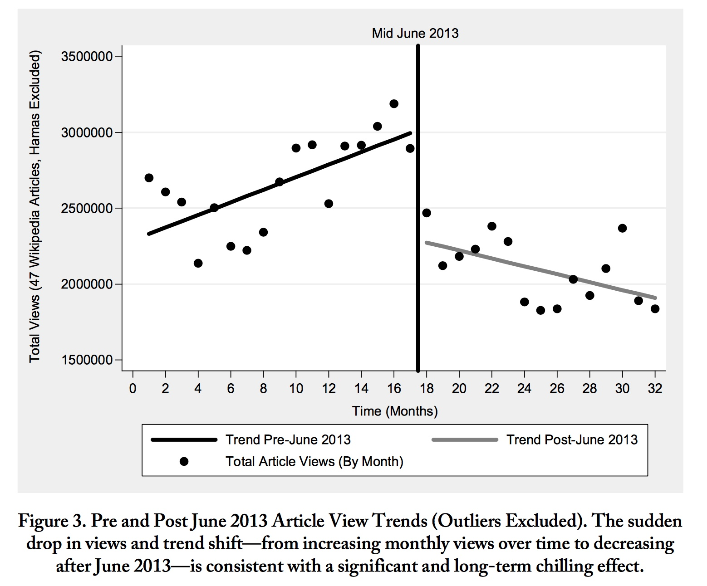

# Exercises

## Exercise #1 - 2020 - Michel et al. Replication

Due Thursday, Jan 30 (which is defined operationally as before Friday, Jan 31, 7:00 am)

Complete the replication and discussion of Michel, et al., in Bit by Bit, Chapter 2, Exercise 6, parts (a) through (g).

Technical note: So that we don't have anyone blowing up their hard drives / bandwidth etc., please note that when Salganik says "Please read all parts of the question before you begin coding" and "Get the raw data from the Google Books NGram Viewer," he is telling you to get the data *you need to answer this question.* For part (a) you need counts of single words (unigrams or 1-grams) like "1875" or "1932." You only need to download the data from a single link on the page he provides. The file at that link is 283M compressed and 1.5G uncompressed. If you've downloaded more than that, you've downloaded more than you need. Moreover, the data you actually need is a tiny fraction of that 2.4G, so you don't need to keep all of it, or load all of it into memory -- figure out how to load just the part you need. Do all the cleaning / subsetting with code ... don't open a 1.5G file in Excel and delete 1.4G+ of rows. (Hint: If using R or Python, process the file line by line, discarding the ones you don't need. Or use a shell like bash -- a couple of the commands listed in Goist and Monroe's "Taking Data Seriously" will work wonders.)

(For part b, you also need the tiny "total_counts" file.)

You'll do this in assigned teams of two or three.

Submit your team's answer, and the code, as an R Notebook or Jupyter (Python) notebook. 

* R: create an R Markdown file (.Rmd) in RStudio, with `output: html_notebook` in the preamble. This will create a notebook file (.nb.html) when you "Preview" or "Knit". Submit - or provide in a github repository - both files. 
* Python: Create your notebook in Jupyter and submit -- or provide in a github repository -- your .ipynb file OR create your notebook on Google Colab and send me a link. 
* IN BOTH CASES ... if your code works directly on the two data files as downloaded (compressed or uncompressed) -- that is, if your cleaning / subsetting / etc. is in your notebook code -- assume they are in the same directory as your code and don't submit them. (I DON'T WANT MULTIPLE COPIES OF THE 283M  OR 2.4G FILE !!!) If instead your code works directly on a small subset cleaned outside of the notebook, submit -- or provide in the github repository -- the altered files and the cleaning code. 

## Exercise #2 - 2020 - Penney (2016) Replication

Due Friday, Feb 21, 5:00pm (Groups as assigned in class)

This exercise is based on Salganik, 2.7, and involves a semi-replication of Penney (2016): Penney, J.W., 2016. Chilling effects: Online surveillance and Wikipedia use. Berkeley Tech. LJ, 31, p.117.

Consider Figure 3, which demonstrates a "chilling effect" around the Snowden revelations on June 6, 2013: 

1. Get wikipedia page view data using R package wikipediatrend. Calculate and redraw the monthly observations in this figure using just the "Terrorism" page. (It will not be exactly the same -- Penney aggregated a lot of terms and "removed outliers.") (You don't need to recalculate or show the regression lines.) 
2. Redraw Figure 3 using longer time period and finer grain of time.
3. Select a comparison page that would help diagnose problems in the page view data (effects on *all* pages, like server going down or internet slowdowns for some part of the world). Make an informative plot about what this reveals.
4. Select a comparison page that would help diagnose whether Wikipedia view data for “Terrorism” also display the college freshman effect we saw in Google Trends (see discussion in Goist and Monroe 2020 if you don't remember this). Make an informative plot about what this reveals.
5. Compare Google Trends data for searches in the US for “terrorism” over the same period you used in #2. Are Google Trends and Wikipedia views measuring similar constructs?
6. Do you buy Penney’s conclusion that the Snowden revelations had a “chilling effect”? Why or why not?

----

# Archive

## Exercise #1 - 2019 - Squinting at Google Trends and Google Ngrams
Due Monday, Jan 14 (which is defined operationally as before Tuesday, 7:00 am)

### Part A:

Consider the following search on Google Trends: <https://trends.google.com/trends/explore?date=all&geo=US&q=islam> (relative use of the search term "islam" in the US for all time available.

 

You can see what appears to be a seasonal pattern. I want your team to discuss what you think the cause of that is and try to think of comparison search terms that would follow a related pattern if that were the cause. It doesn't have to be identical ... you might think of something that should move in the opposite direction or be the same but shifted 3 months. But of course just finding seasonality isn't hard. 

How about <https://trends.google.com/trends/explore?date=all&geo=US&q=islam,oranges> :

  

Or <https://trends.google.com/trends/explore?date=all&geo=US&q=islam,basketball> :

 

In any case ... does it look like you were right? If not, keep trying.

Write a paragraph giving your team's best explanation for the pattern, and a small set of comparison terms that you think best support your case. 

### Part B:

This figure from Google Books Ngrams Viewer implies that texting peaked in the 17th century:

<https://books.google.com/ngrams/graph?content=fyi%2Cftw%2Cwtf&year_start=1650&year_end=2000&corpus=15&smoothing=10&share=&direct_url=t1%3B%2Cfyi%3B%2Cc0%3B.t1%3B%2Cftw%3B%2Cc0%3B.t1%3B%2Cwtf%3B%2Cc0>

What the hell is going on here? Use any evidence you want, or just conjecture. Write another paragraph with your team's best explanation. 

### Data Wrangling Exercise (Exercise 3 - 2018)

1. [Tidyverse (R) Solution](https://burtmonroe.github.io/SoDA501/Exercises/Exercise3-2018/TidyverseSolution)
2. [data.table (R) Solution](https://burtmonroe.github.io/SoDA501/Exercises/Exercise3-2018/datatableSolution/Exercise3-datatableSolution.html)
3. pandas (Python) Solution
4. Trifacta Wrangler Solution
